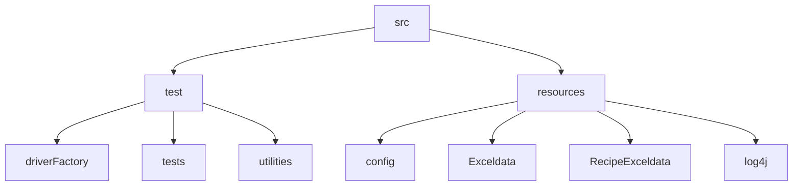

# RecipeScrapperProjectTeam05
## Table of contents
* [General info](#general-info)
* [Tools and Technologies](#tools-and-technologies)
* [FrameWork](#framework)
* [Running Project](#running-project)

## General info
* Introduction : Scraper project 

## Tools and Technologies
Project is created with:
* Maven - Dependency management
* Java
* Selenium Webdriver
* TestNG - Unit framework
* log4j - Logging

## Framework

## Running Project
To run this project, 
Open terminal (MAC OS) or command prompt / power shell (for windows OS) and navigate to the project directory type mvn clean test command to run features
```
$ cd <Project Directory>

$ mvn clean test
```
Scraping will run in order :

HTML Report: 

Report will be generated tо directory: test-output/index.html


